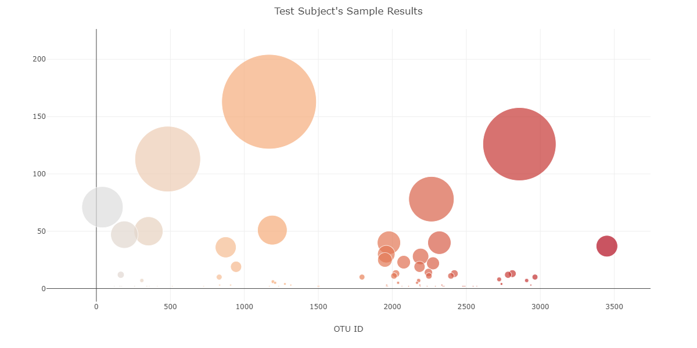
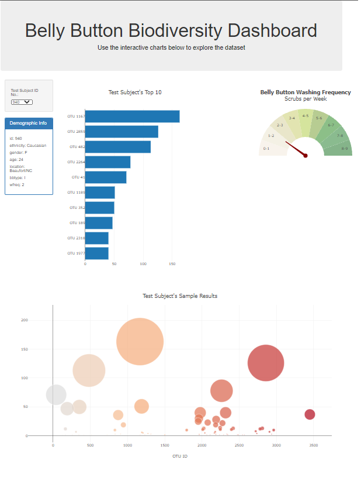

Belly Button Biodiversity

In this assignment, you will build an interactive dashboard to explore the [Belly Button Biodiversity dataset](http://robdunnlab.com/projects/belly-button-biodiversity/), which catalogs the microbes that colonize human navels.

The dataset reveals that a small handful of microbial species (also called operational taxonomic units, or OTUs, in the study) were present in more than 70% of people, while the rest were relatively rare.

## Step 1: Plotly

Create a horizontal bar chart with a dropdown menu to display the top 10 OTUs found in that individual.

  

Create a bubble chart that displays each sample.

  

Display the sample metadata, i.e., an individual's demographic information.
Display each key-value pair from the metadata JSON object somewhere on the page.

  

Update all of the plots any time that a new sample is selected.

The dashboard is shown below:

## Advanced Challenge Assignment (Optional)
Adapt Gauge Chart to plot the weekly washing frequency of the individual.
Update the chart whenever a new sample is selected.

[Deployed app click here!](https://zone6mars.github.io/plot.ly/index.html)

## Rubric

[Unit 14 Rubric - Plot.ly Homework - Belly Button Biodiversity](https://docs.google.com/document/d/1wD_hOEJELD2hifTaECfx66xlpEdJeYm3mL8q2Zoq1vo/edit?usp=sharing)

- - -

## References

Hulcr, J. et al.(2012) _A Jungle in There: Bacteria in Belly Buttons are Highly Diverse, but Predictable_. Retrieved from: [http://robdunnlab.com/projects/belly-button-biodiversity/results-and-data/](http://robdunnlab.com/projects/belly-button-biodiversity/results-and-data/)

- - -

© 2021 Trilogy Education Services, LLC, a 2U, Inc. brand. Confidential and Proprietary. All Rights Reserved.
